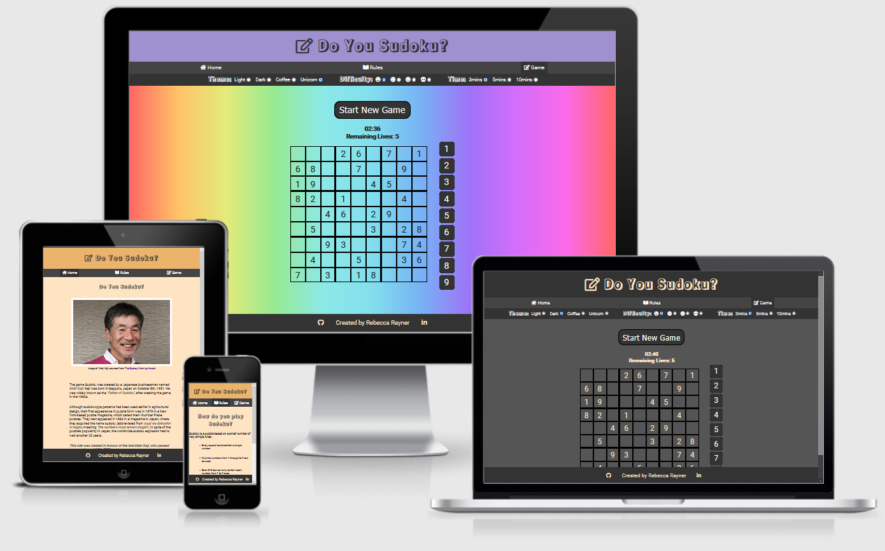
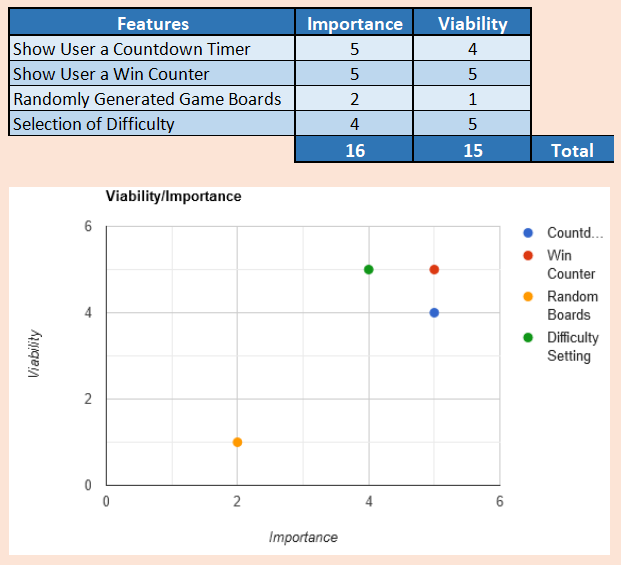
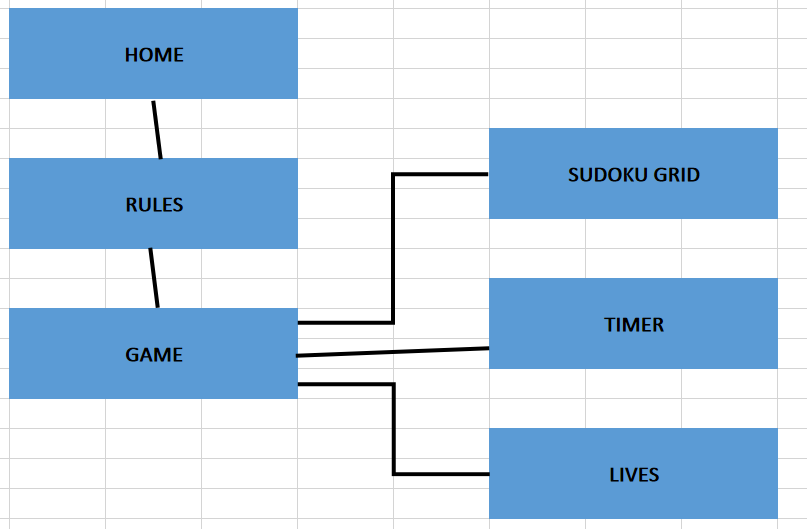
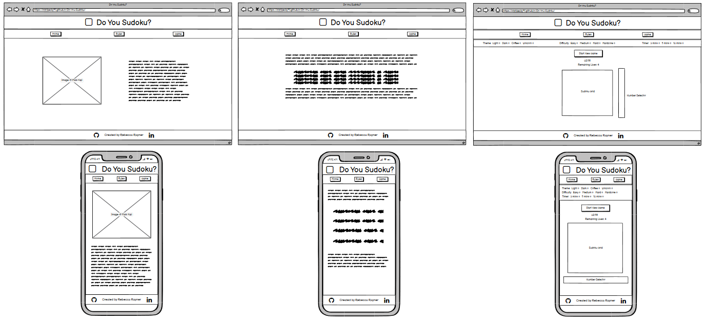

# Do You Sudoku?

[View the live project here](https://irishbecky91.github.io/Do-you-Sudoku/)

## Table of contents
1. [Introduction](#Introduction)
2. [UX](#UX)
    1. [Ideal User Demographic](#Ideal-User-Demographic)
    2. [User Stories](#User-Stories)
    3. [Development Planes](#Development-Planes)
    4. [Design](#Design)
3. [Features](#Features)
    1. [Design Features](#Design-Features) 
    2. [Existing Features](#Existing-Features)
    3. [Features to Implement in the future](#Features-to-Implement-in-the-future)
4. [Issues and Bugs](#Issues-and-Bugs)
5. [Technologies Used](#Technologies-Used)
     1. [Main Languages Used](#Main-Languages-Used)
     3. [Frameworks, Libraries & Programs Used](#Frameworks,-Libraries-&-Programs-Used)
6. [Testing](#Testing)
     1. [Testing.md](TESTING.md)
7. [Deployment](#Deployment)
     1. [Deploying on GitHub Pages](#Deploying-on-GitHub-Pages)
8. [Credits](#Credits)
     1. [Content](#Content)
     2. [Media](#Media)
     3. [Code](#Code)
9. [Acknowledgements](#Acknowledgements)
***

## Introduction

This website was made to allow the user to play sudoku using a range of difficulty settings. In addition to this, the site was also created as a dedication to the life of Maki Kaji, the "Father of Sudoku". Maki recently passed away from cancer on August 10th 2021.

This website was made for the second of five Milestone projects required to complete the Diploma in Software development (eCommerce Applications) program at The Code Institute. 

The main requirements of this project are to build a responsive and interactive front-end site all the technologies learned so far, namely HTML5, CSS3 and JavaScript.

[Back to top ⇧](#)

## UX
### Ideal User Demographic
The ideal user for this website is:
* New user
* Gaming user

#### New User Goals
1. As a new user, I want to easily navigate the site intuitively. 
2. As a new user, I want the instructions to be easily found, clear and concise.
3. As a new user, I want attractive and relevant visuals and colour schemes that work with the content.

#### Current User
1. As a current user, I want to have a variety of difficulty options, to challenge myself.
2. As a current user, I want to have an option of a timed game.
3. As a current user, I want to see randomly generated puzzle boards for each difficulty level.

### Development-Planes
To create an interactive website that allows the user to play the game Sudoku, with the option of several game setting to challenge and entertain the user.

#### Strategy
Strategy incorporates user needs as well as product objectives. This website will focus on the following target audience, divided into three main categories:
- **Roles:**
    - New users
    - Current users

- **Demographic:**
    - All ages
    - All puzzle playing levels

- **Psychographic:**
    - Lifestyles:
        - Interest in games
        - Interest in numbers
        - Interest in puzzles
    - Personality/Attitudes:
        - Focused
        - Forward-Thinking
        - Arithmetically minded
    
The website needs to enable the **user** to:
- play the game sudoku with their choice of game settings:
    - Difficulties of easy, normal, hard or hardcore.
    - Timer lengths of 3 minutes, 5 minutes or 10 minutes.
    - Page themes of light, dark, coffee and unicorn.
- generate a new board on each play-through:
    - Randomly generated boards using an algorithm.
    - Premade boards based on difficulty
    
With the above information in mind, a strategy table was created to show the trade-offs between what is important and what is viable with the following results.

Strategy Plane - Viability/Feasibility Table

#### Scope
The scope plane is about defining requirements based on the goals established on the strategy plane. Using the information in the strategy plane, the identified required features have been broken into the following two categories.
- Content Requirements:
    - The user will be looking for:
        - Clear and concise instructions.
        - Choice of puzzle layouts; easy, normal, hard or hardcore.
        - Choice of timer length; 3 minutes, 5 minutes or 10 minutes.
        - Choice of page theme; light , dark, coffee and unicorn.
- Functionality Requirements:
    - The user will be able to:
        - Be able to easily navigate the site to find the play instructions.
        - Be able to tailor the game to their preferences.

#### Structure
The information above was then organized in a hierarchical tree structure, a site map, showing how users can navigate through the site with ease and efficiency, with the following results:

Site Map

#### Skeleton
Wireframes were made to showcase the appearance of the site pages while keeping a positive user experience in mind. The wireframes were created using a desktop version of [Balsamiq](https://balsamiq.com/).

Balsamiq Wireframes

    

### Design
#### Colour Scheme
The default colour scheme throughout the site was chosen to have a warm and comforting appearance. The warm tones and simple design are designed to encourage the user to take a little time and enjoy a relaxing puzzle. 

On the game page, the user is given the option of four themes use while playing the game, making the experience more personalised. The light and dark themes are designed to give a simple, minimilistic platform to play on. There is little to no colour aside from the whites and dark greys in these themes. This will allow the user to focus solely on the puzzle without distraction.

The coffee theme is meant to resemble a cup of coffee a user may be enjoying while using the puzzle on a quick break. The colours are warm and inviting, creating a perfectly relaxing platform for play.

The unicorn theme is designed to represent a little more fun. The bright and varied colours, used in a gradient, form a rainbow across the body of the page. This theme is to appeal to users with a sense of fun and whimsy. It is also designed to give visual stimulation to users who may need a busy screen to be able to focus.

#### Typography
The typography pairing used on the site are [Rampart One](https://fonts.google.com/specimen/Rampart+One?query=ramp) and [Roboto](https://fonts.google.com/specimen/Roboto), imported from [Google Fonts](https://fonts.google.com/). A backup of Sans-Serif had been applied in case of import failure.

Rampart One was chosen for all headers, with Open Sans being used for standard text. This offers a clear font which is easy to read, while still having a nice design.

#### Imagery
The  on the home page was sourced from an article on The Sydney Morning Herald's website. A note was placed below the image, with a link to the article for the user to follow.

[Back to top ⇧](#)

## Features
### Design Features
Each page within the site has a consistent and responsive navigation system. The details of features on the site are detailed below.
- The **Header** is across the top of the page. It is not static as this would cover too much of the screen.
- The **Navigation Bar** is positioned directly below the header.
- The **Footer** stays at the bottom of the screen at all times, on all screen sizes. Both social media links on the footer open in a new tab. Additionally, both links opens to the developer's profiles in LinkedIn and GitHub. The icons are positioned on either side of some text showing "Created by Rebecca Rayner".

<dl>
    <dt><a href="https://irishbecky91.github.io/Do-you-Sudoku/index.html" target="_blank" alt="Home Page">Home Page</a></dt>
    <dd>
        The <em>Home Page</em> is a scrollable page with the main content divided into two columns on larger screens, shifting into a single column on smaller screens.
        <ul>
            <li>
                <em>Image</em> - This image shows the businessman Maki Kaji, to whom the site is dedicated to. there is also a link below the image to the site the image was sourced from. 
            </li>
            <li>
                <em>Introduction</em> - This text-only section tells the user about the origin of Sudoku, and of the man that created it.
            </li>            
        </ul>
    </dd>
</dl>
<dl>
    <dt><a href="https://irishbecky91.github.io/Do-you-Sudoku/instructions.html" target="_blank" alt="Instructions Page">Instructions Page</a></dt>
    <dd>
        The <em>Instructions Page</em> is a scrollable text-only page. It shows the users the rules of playing Sudoku.
        <ul>
            <li>
                <em>Instructions</em> - This text-only section introduces the user to the rules of playing Sudoku. 
            </li>
        </ul>
    </dd>
</dl>
<dl>
    <dt><a href="https://irishbecky91.github.io/Do-you-Sudoku/game.html" target="_blank" alt="Game Page">Game Page</a></dt>
    <dd>
        The <em>Game Page</em> is a scrollable page which generates a Sudoku game based on the users chosen game settings.
        <ul>
            <li>
                <em>Game Options</em> - This is a bar below the navigation bar which shows the three different settings available to the user, shown below. 
            </li>
            <li>
                <em>Difficulty Settings</em> - This input section allows the user to select the difficulty level of sudoku puzzle they wish to play. There are four pre-programmed board layouts available; easy, medium, hard and hardcore. The options are labeled using icons from <a href="https://fontawesome.com/" aria-label="Link to Font Awesome's Website" target="_blank">Font Awesome</a>.
            </li>
            <li>
                <em>Timer Settings</em> - This input section allows the user to select the length of time they wish to play for. There are three available options; 3 minutes, 5 minutes and 10 minutes.
            </li>
            <li>
                <em>Theme Settings</em> - This input section allows the user to select the theme they wish to see while playing the game. There are four available options; Light, Dark, Coffee and Unicorn.
            </li>
            <li>
                <em>Start New Game Button</em> - This button, when clicked, starts the game with the users desired settings. This button triggers the JavaScript function which generates a Sudoku board based on saved board layouts and solutions.
            </li>
            <li>
                <em>Timer</em> - This section contains a countdown timer, using the users chosen time selection. If the time runs out, the game is lost.
            </li>
            <li>
                <em>Remaining Lives</em> - This section shows the number of remaining lives, as well as the win or lose message when a game ends. If the user runs out of lives, the game is lost.
            </li>
            <li>
                <em>Sudoku Grid</em> - This grid of 9x9 squares is created using a JavaScript function when the Start New Game button is clicked. A series of Sudoku board and solution pairs were saved as seperate arrays, one for each difficulty setting. If both a square within the grid and a number from the number selector is clicked, the number from the selector is inserted into the square. If the user fills in the entire grid with lives and time remaining, the game is won.
            </li>
            <li>
                <em>Number Selector</em> - This section contains nine divs with numbers, from 1 to 9, in each box. When a number and a square are both clicked, the number transfers to the square
            </li>
        </ul>
    </dd>
</dl>

### Existing Features
- **Header** - Appearing on every page for brand recognition.
- **Navigation Bar** - Appearing on every page for a consistently easy and intuitive navigable system.
- **Social Media Icons** - Appearing on every page, the icons are appropriate representations of the Social Media platforms, linking users to the developers GitHub and LinkedIn accounts. The icons appear in the centre of the footer, on either side of some text.
- **[Home Page](https://irishbecky91.github.io/Do-you-Sudoku/index.html "Do You Sudoku? - Home Page")** - Introducing the user to a very brief history of Sudoku.
- **[Intructions Page](https://irishbecky91.github.io/Do-you-Sudoku/instructions.html "Do You Sudoku? - Instructions Page")** - Informing the user of the rules of playing Sudoku.
- **[Game Page](https://irishbecky91.github.io/Do-you-Sudoku/game.html "Do You Sudoku? - Game Page")** - Creates a custom Sudoku game using the users chosen settings.

### Features to Implement in the future
- **Sudoku Grid Generator**
     - **Feature** - Uses an algorithm to produce solvable sudoku puzzles based on the users chosen difficulty settings.
     - **Reason for not featuring in this release** - A lack of experience and time prevented the developer from making this feature upon release. This feautre will be developed and implemented in the future to improve repeat play by users.

[Back to top ⇧](#)